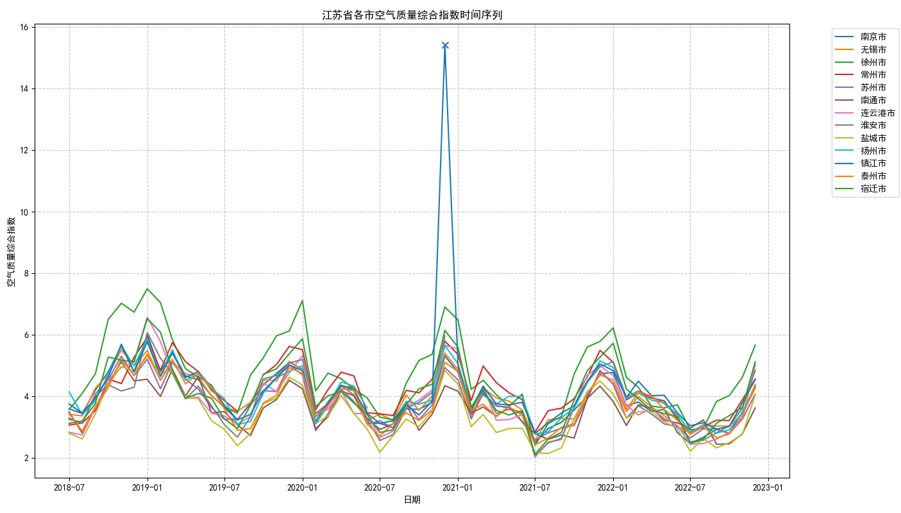
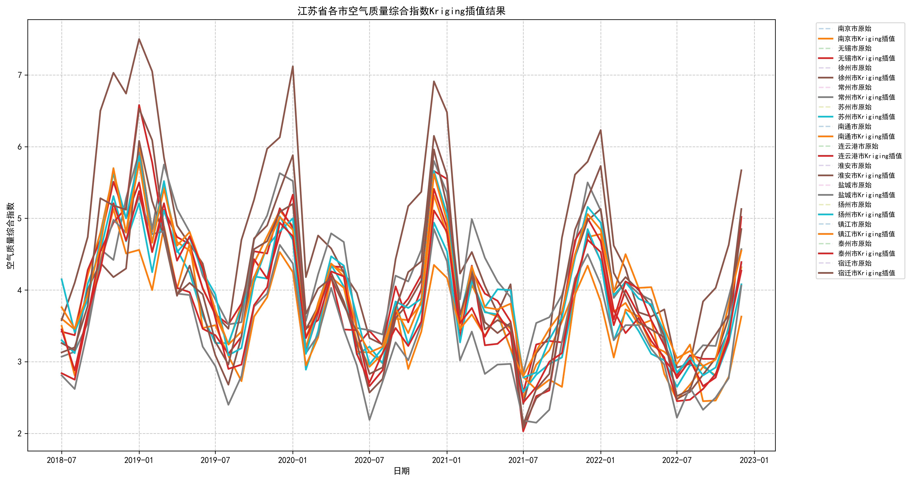
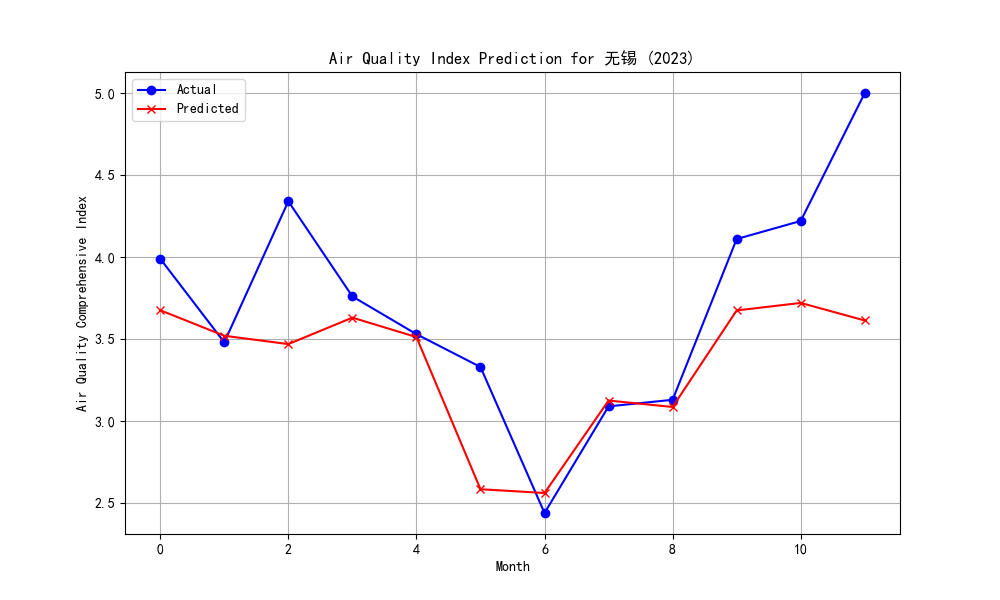
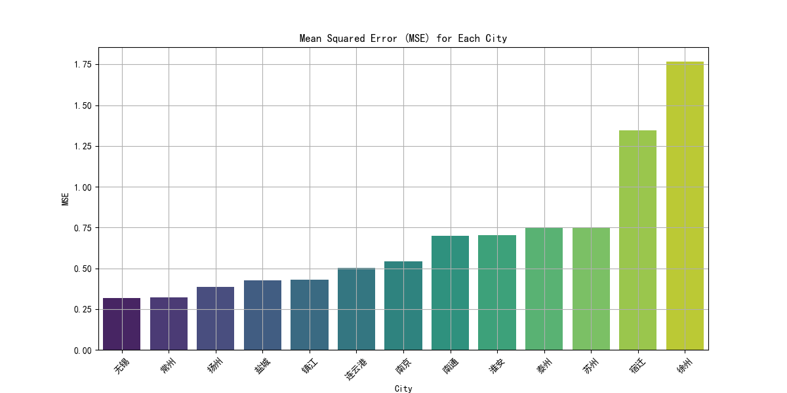
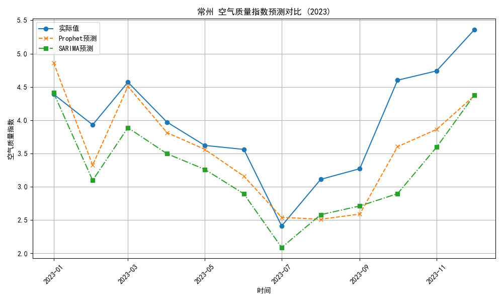
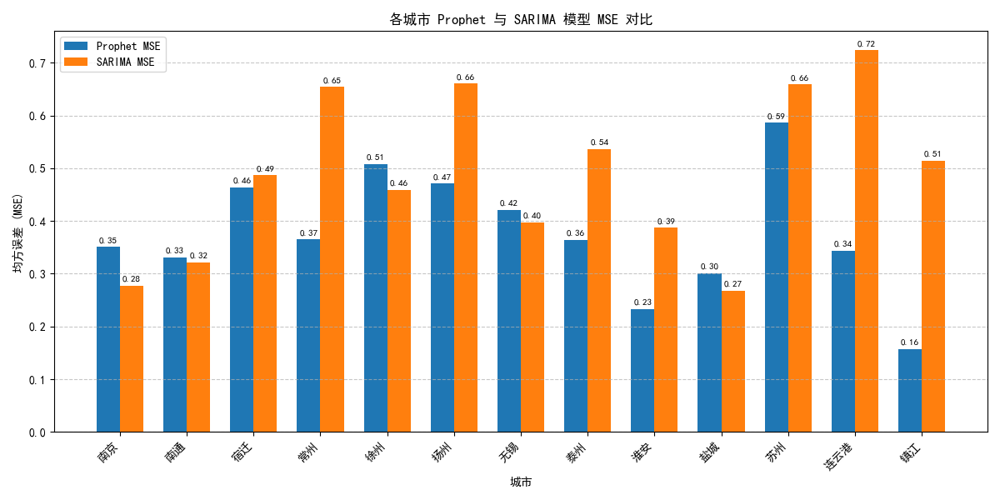
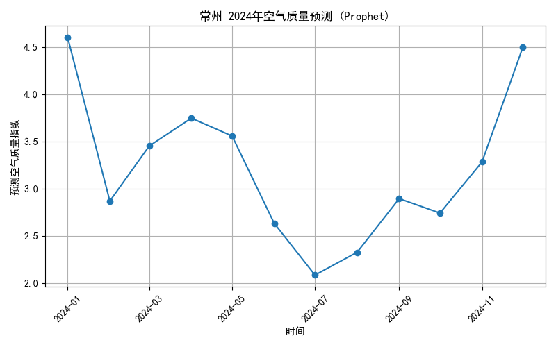
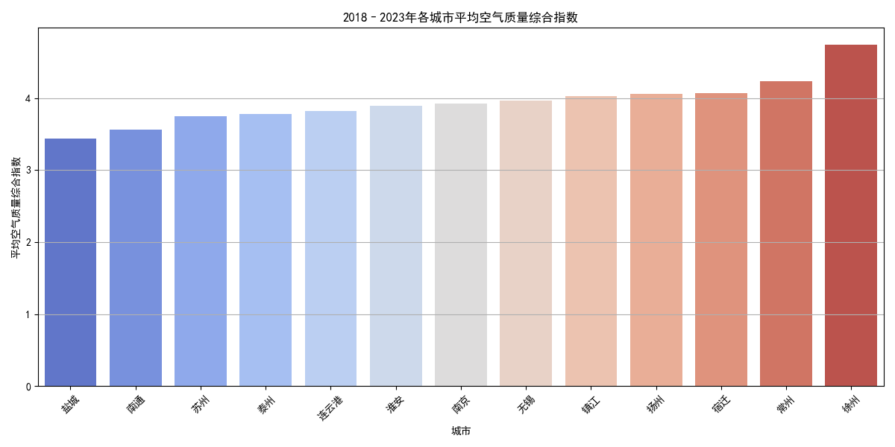
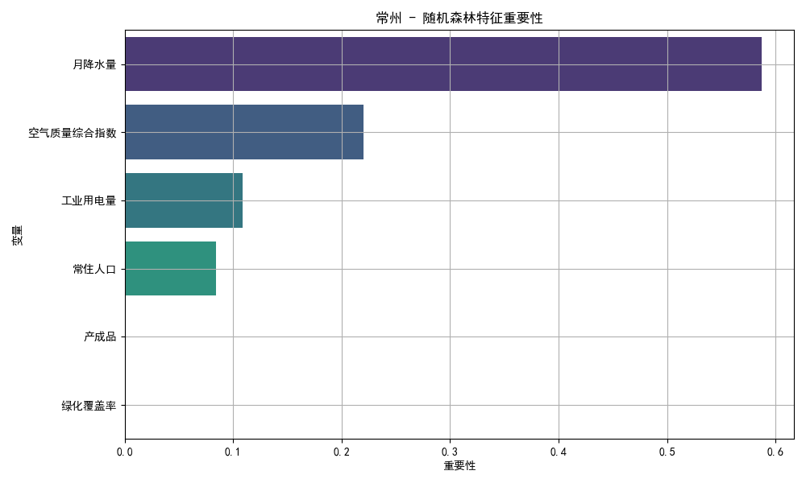

# 摘要

本研究针对江苏省13个地级市2018年7月至2023年12月的空气质量综合指数进行了系统分析与建模。研究首先对原始数据进行清洗与插值处理，采用基于四分位距的异常值检测方法和三次样条插值、ARIMA预测插值、逆距离加权（IDW）插值、克里金（Kriging）插值的插值方法处理缺失数据。在此基础上，构建了考虑污染源排放、气象因素和环境承载力的空气质量微分方程模型，通过最小二乘法估计模型参数并进行稳定性分析。同时，采用SARIMA和Prophet两种时间序列预测模型对各市空气质量进行预测，通过MSE评估模型性能并选择最优模型用于2024年预测。研究发现，沿海城市（盐城、南通、苏州、连云港）空气质量普遍优于内陆城市，徐州和宿迁的空气质量最差且预测难度最大。基于模型分析结果，提出了分区精准管控、动态模型优化和差异化生态补偿等区域协同治理策略。研究成果为江苏省空气质量管理和污染防治提供了科学依据和决策支持。

关键词 ：空气质量综合指数；微分方程模型；时间序列预测；SARIMA模型；Prophet模型；区域协同治理

# 一、问题重述

江苏省共有13个地级市，自2018年7月至2023年12月，各市记录了月度空气质量综合指数（常以AQI表示）的变化情况。研究的主要任务包括：

对原始数据进行清洗和插值，考虑气象、经济、地理因素，建立空气质量综合指数的微分方程模型，并进行未来预测和区域协同治理分析，以期揭示影响空气质量的主要因素，预测未来空气质量，提出有效的污染控制策略。

研究意义：空气质量直接关系公众健康和生态环境。江苏省工业发达、人口密集，PM2.5、VOCs等污染物对区域大气质量影响显著。有效的数据处理和精确的预测模型可为政府决策和协同治理提供科学依据。本研究以数学建模常见框架展开，对数据和模型进行详细分析，以期得到完整的建模报告。

# 二、符号说明

为便于理解本研究中的数学模型和数据处理方法，以下对文章中使用的符号进行分类说明。符号按功能分为一般变量、数据预处理相关符号、空气质量微分方程模型相关符号及其他符号。为避免冗长，仅列出多次使用的符号，单次使用的符号将在正文中直接定义。

### 2.1.问题变量

| 符号       | 说明                                                                                                 |
| ---------- | ---------------------------------------------------------------------------------------------------- |
| $ A_i(t) $ | 第$ i $市在时间$ t $的空气质量综合指数，表示空气污染程度。                                           |
| $ t $      | 时间，以月为单位，从2018年7月起，用于表示时间序列数据的时间点。                                      |
| $ E_i(t) $ | 第$ i $市在时间$ t $的污染源排放强度指标，可通过工业能耗、机动车保有量等代理，反映污染源的总体强度。 |
| $ M_i(t) $ | 第$ i $市在时间$ t $的气象因素向量，包括温度、湿度、风速、降水量等，影响污染物扩散和沉降。           |
| $ G_i $    | 第$ i $市的地理特征，如海拔、地形类型，通常视为时间不变的常量。                                      |
| $ C_i $    | 第$ i $市的社会经济指标，如人均GDP、人口密度、能源消费，反映城市发展对空气质量的影响。               |

### 2.2.异常值检测
用于识别和处理数据中的异常点：

| 符号         | 说明                                                                                              |
| ------------ | ------------------------------------------------------------------------------------------------- |
| $ Q_1, Q_3 $ | 数据的上下四分位数，用于计算数据分布的中间50%范围。                                               |
| $ IQR $      | 四分位距，计算公式为$ IQR = Q_3 - Q_1 $，用于定义异常值范围。                                     |
| $ k $        | 异常值判定的阈值系数，本研究取1.5，用于确定异常值区间$ [Q_1 - k \cdot IQR, Q_3 + k \cdot IQR] $。 |

### 2.3.插值方法
用于填补缺失数据，包括时间序列插值和空间插值：

| 符号           | 说明                                                           |
| -------------- | -------------------------------------------------------------- |
| $ \hat{y}(t) $ | 时间$ t $处的插值估计值，表示通过插值方法预测的缺失数据值。    |
| $ y_i $        | 已知数据点的值，用于插值计算。                                 |
| $ t_i $        | 已知数据点的时间，用于时间序列插值。                           |
| $ w_i $        | 插值权重，通常基于距离或其他相关性计算。                       |
| $ d_{ij} $     | 城市$ i $和$ j $之间的距离，用于空间插值方法如逆距离加权插值。 |
| $ s_i $        | 第$ i $个采样点的空间位置，表示地理坐标。                      |

**注**：某些插值方法（如克里金插值）中使用的特定符号，如半变异函数$ \gamma(h) $，因仅在特定章节出现，将在正文中定义。

### 2.4.外部输入变量

表示影响空气质量的外部因素：

| 符号       | 说明                                                                 |
| ---------- | -------------------------------------------------------------------- |
| $ P_i(t) $ | 第$ i $市在时间$ t $的产成品，反映工业生产规模，是污染源的重要指标。 |
| $ E_i(t) $ | 第$ i $市在时间$ t $的工业用电量，反映能源消耗，与污染排放密切相关。 |
| $ N_i(t) $ | 第$ i $市在时间$ t $的常住人口，反映人为活动对空气质量的影响。       |
| $ R_i(t) $ | 第$ i $市在时间$ t $的月降水量，影响污染物沉降。                     |
| $ G_i(t) $ | 第$ i $市在时间$ t $的绿化覆盖率，反映环境承载能力。                 |

### 2.5.模型参数
表示微分方程中的系数，描述各因素对空气质量的影响程度：

| 符号                                      | 说明                                                                               |
| ----------------------------------------- | ---------------------------------------------------------------------------------- |
| $ \alpha_i $                              | 第$ i $市的基准积累项，表示空气质量变化的常数项。                                  |
| $ \beta_i $                               | 描述空气质量自身滞留效应的系数，反映污染的累积特性。                               |
| $ \gamma_{1i}, \gamma_{2i}, \gamma_{3i} $ | 分别为产成品、工业用电量和常住人口的敏感度系数，表示这些因素对空气质量变化的贡献。 |
| $ \mu_{1i}, \mu_{2i} $                    | 分别为月降水量和绿化覆盖率的敏感度系数，表示这些因素对污染净化的作用。             |
| $ \lambda_i $                             | 代表自然消散或治理强度的系数，反映污染物自然减少或治理效果。                       |

# 三、模型假设

为构建合理模型并简化计算，提出以下假设：

* **主要影响因素：** 空气质量主要受工业排放、交通排放、季节性气象条件等综合影响，忽略极端事件（如工厂爆炸、森林火灾等偶发因素）对分析结果的短期干扰。各市的污染源排放可通过相应的经济社会指标近似反映。

* **指数连续性：** 空气质量综合指数随时间变化平滑，数据中可能存在测量误差或缺失，需要通过插值方法进行修正和补全；忽略人为监测系统的大规模系统性误差。

* **经济社会稳定：** 短期内（年内）社会经济指标相对稳定，可视为模型中常数；长期建模时可按年变化更新。人口、工业结构等对污染的影响通过线性或弱非线性关系体现。

* **模型形式：** 空气质量变化可用常微分方程描述（可视作“污染累积-扩散-沉降”的一阶动力学过程），假设其解决方案不存在奇异爆发，在参数符合实际范围时系统稳定。

* **气象稳定**：对于月平均气温和月平均降水数据，考虑其季节性变化，但是不考虑极端天气对空气质量的影响，也不考虑每年的气候变化对空气质量的影响。

# 四、数据预处理

本章介绍江苏省13个地级市2018年7月至2023年12月空气质量综合指数数据的清洗和插值方法。数据预处理的目标是识别和处理缺失值、检测异常值，并通过合适的插值技术填补缺失数据，为后续建模和预测提供高质量的数据基础。本章分为数据清洗、插值方法及方法比较与选择三个部分。

## 4.1 数据清洗

数据清洗旨在识别缺失值和异常值，确保数据的完整性和可靠性。

### 4.1.1 缺失值识别

原始数据中的缺失值以反斜杠（\）标记。通过扫描数据，构建缺失值索引矩阵 \( M_{ij} \)，其中 \( i \) 表示城市，\( j \) 表示时间点：

\[
M_{ij} = \begin{cases}
1, & \text{如果 } (i,j) \text{ 位置数据缺失} \\
0, & \text{其他情况}
\end{cases}
\]

该矩阵记录了每个城市在每个时间点的缺失情况，为后续插值提供依据。

### 4.1.2 异常值检测

为确保数据质量，采用基于四分位距（IQR）的异常值检测方法。对每个城市的时间序列数据，步骤如下：
1. 计算数据的上下四分位数 \( Q_1 \) 和 \( Q_3 \)；
2. 计算四分位距：\( IQR = Q_3 - Q_1 \)；
3. 定义异常值判定区间：
   \[
   [Q_1 - k \cdot IQR, Q_3 + k \cdot IQR]
   \]
   其中 \( k = 1.5 \)，为标准阈值；
4. 将超出此区间的数据点标记为异常值，并记录其位置。

异常值可能由测量误差或极端污染事件引起，标记后可选择替换为插值结果。

## 4.2 插值方法

插值方法用于填补缺失数据，分为时间序列插值和空间插值两类。本研究根据空气质量数据的特点（时间依赖性和空间相关性）选择合适的插值方法。

### 4.2.1 时间序列插值

时间序列插值适用于单个城市的时间序列数据，强调数据的连续性和季节性。

#### 三次样条插值

**起源与特点**：三次样条插值是一种通过分段三次多项式拟合数据的方法，起源于数值分析领域。它适用于数据变化平滑、缺失点较少的场景，能保证插值曲线的光滑性和连续性（包括一阶和二阶导数），特别适合空气质量指数等连续变化的数据。

**公式**：在时间区间 \( [t_i, t_{i+1}] \) 上，三次样条函数形式为：
\[
S_i(t) = a_i (t - t_i)^3 + b_i (t - t_i)^2 + c_i (t - t_i) + d_i
\]
其中，\( a_i, b_i, c_i, d_i \) 为多项式系数，满足以下连续性条件：
- 函数值连续性：\( S_i(t_{i+1}) = S_{i+1}(t_{i+1}) \)
- 一阶导数连续性：\( S_i'(t_{i+1}) = S_{i+1}'(t_{i+1}) \)
- 二阶导数连续性：\( S_i''(t_{i+1}) = S_{i+1}''(t_{i+1}) \)

**适用场景**：适用于缺失点较少、数据变化平滑的空气质量时间序列，能有效保留数据的趋势和局部特征。

#### ARIMA预测插值

**起源与特点**：ARIMA（自回归综合移动平均模型）是一种经典的时间序列分析方法，起源于统计学和计量经济学，广泛用于捕捉数据的趋势、季节性和随机波动。ARIMA模型通过自回归（AR）、差分（I）和移动平均（MA）组件拟合时间序列，适合具有明显时间依赖性和季节性的空气质量数据。

**公式**：ARIMA(p,d,q)模型形式为：
\[
\phi(B)(1 - B)^d X_t = \theta(B) \varepsilon_t
\]
其中：
- \( B \) 为滞后算子（\( B X_t = X_{t-1} \)）；
- \( \phi(B) = 1 - \phi_1 B - \cdots - \phi_p B^p \) 为自回归多项式；
- \( \theta(B) = 1 + \theta_1 B + \cdots + \theta_q B^q \) 为移动平均多项式；
- \( (1 - B)^d \) 表示 \( d \) 阶差分，用于消除非平稳性；
- \( \varepsilon_t \) 为白噪声误差。

**适用场景**：ARIMA适合空气质量数据中具有季节性波动（如冬季PM2.5浓度升高）或趋势的场景，能通过历史数据预测缺失值。

### 4.2.2 空间插值

空间插值利用城市间的地理关系填补缺失数据，适用于空气质量的空间分布分析。

#### 逆距离加权（IDW）插值

**起源与特点**：逆距离加权（IDW）插值是一种基于距离的简单空间插值方法，起源于地理信息系统（GIS）领域。其假设是距离目标点越近的已知点对插值结果的贡献越大，计算简单且易于实现，适合采样点分布均匀、地理变化较小的场景。

**公式**：待估计点 \( s_0 \) 的插值值为：
\[
\hat{y}(s_0) = \frac{\sum_{i=1}^n w_i y_i}{\sum_{i=1}^n w_i}, \quad w_i = \frac{1}{d_{i0}^p}
\]
其中：
- \( y_i \) 为已知点 \( s_i \) 的观测值；
- \( d_{i0} \) 为待估计点 \( s_0 \) 与已知点 \( s_i \) 间的距离；
- \( p \) 为距离幂次，通常取 \( p = 2 \)；
- \( w_i \) 为基于距离的权重。

**适用场景**：IDW适用于江苏省城市分布较均匀的场景，能快速估计缺失点的空气质量值，但对复杂空间结构（如污染物扩散）的建模能力有限。

#### 克里金（Kriging）插值

**起源与特点**：克里金插值是一种基于空间统计学的最优线性无偏估计方法，起源于地统计学，由南非矿业工程师D.G. Krige提出。它通过半变异函数建模空间相关性，适用于具有空间结构特征的数据（如污染物浓度），能提供估计值及其不确定性。

**公式**：待估计点 \( s_0 \) 的插值值为：
\[
\hat{y}(s_0) = \sum_{i=1}^n \lambda_i y(s_i)
\]
其中：
- \( y(s_i) \) 为已知点 \( s_i \) 的观测值；
- \( \lambda_i \) 为权重，通过求解克里金方程组确定：
  \[
  \begin{cases}
  \sum_{j=1}^n \lambda_j \gamma(h_{ij}) + \mu = \gamma(h_{i0}), & i = 1, \ldots, n \\
  \sum_{j=1}^n \lambda_j = 1
  \end{cases}
  \]
- \( \gamma(h) \) 为半变异函数，表示距离 \( h \) 的空间相关性，在此定义为：
  \[
  \gamma(h) = \frac{1}{2} \text{Var}[y(s_i) - y(s_j)], \quad \text{其中 } h = \| s_i - s_j \|
  \]
- \( \mu \) 为拉格朗日乘子，用于确保无偏估计。

**适用场景**：克里金插值适合空气质量数据中存在空间相关性的场景（如污染物随风向扩散），能提供更精确的估计，尤其在城市间距离差异较大时。

## 4.3 插值方法比较与选择

### 4.3.1 方法特点比较

- **时间序列插值**：
  - **三次样条插值**：优点是计算简单，曲线光滑，适合缺失点较少、变化平滑的数据；缺点是对季节性或复杂趋势的捕捉能力较弱。
  - **ARIMA预测插值**：优点是能捕捉时间依赖性和季节性，适合具有周期性波动的数据；缺点是模型参数选择需经验支持，计算复杂度较高。
- **空间插值**：
  - **IDW插值**：优点是实现简单，适合均匀分布的采样点；缺点是未考虑空间相关性，估计精度较低。
  - **克里金插值**：优点是考虑空间相关性，提供估计误差，适合复杂空间结构；缺点是依赖半变异函数的准确建模，计算成本较高。

### 4.3.2 方法选择依据

空气质量综合指数数据具有以下特点：
- **时间依赖性**：数据呈现明显的季节性（如冬季污染加重）和趋势（如治理效果导致的长期下降）。
- **空间相关性**：相邻城市的空气质量受污染物扩散影响，存在空间结构。

基于这些特点：
- 对于时间连续性强的缺失数据，优先选择**ARIMA预测插值**，因其能有效捕捉季节性和时间趋势，适合空气质量数据的动态特性。
- 对于空间相关性强的缺失数据，优先选择**克里金插值**，因其考虑了城市间的空间结构，能提高插值精度。
- 在实际操作中，先使用ARIMA插值处理时间序列缺失值，再结合克里金插值补充空间缺失值，以兼顾时间和空间特性。

### 4.3.3 敏感度分析计划

后续将在模型验证阶段进行插值方法的敏感度分析，比较不同方法对模型预测精度的影响。具体方法包括：
- 使用交叉验证评估插值结果的误差（如均方根误差，RMSE）。
- 分析插值方法对微分方程模型参数估计的稳定性影响。
- 讨论时间序列插值和空间插值的适用场景差异，为未来研究提供参考。

# 第五章：空气质量微分方程模型分析

本章介绍江苏省13个地级市空气质量综合指数（AQI）的微分方程模型分析，旨在模拟空气质量的动态变化并为污染治理提供科学依据。模型综合考虑污染源排放、气象因素和环境承载力，通过参数估计、稳定性分析、模型验证和敏感性分析，揭示影响空气质量的关键因素。本章分为模型构建、参数估计、模型特性分析、模型验证与评估以及敏感性分析五个部分。

## 5.1 模型构建

### 5.1.1 模型背景与意义

空气质量受污染源排放、气象条件和环境承载力的共同影响，呈现复杂的动态变化。为捕捉这一过程，本研究构建了一个基于常微分方程的模型，模拟污染累积、扩散和沉降的动态机制。该模型以空气质量综合指数（AQI）为状态变量，纳入工业生产、人口活动、降水和绿化等因素，适用于分析江苏省各城市的空气质量变化趋势。

### 5.1.2 模型形式

基于污染源、气象和环境因素，模型定义如下：

\[
\frac{dA_i}{dt} = \alpha_i + (\beta_i - \lambda_i) A_i(t) + \gamma_{1i} P_i(t) + \gamma_{2i} E_i(t) + \gamma_{3i} N_i(t) - \mu_{1i} R_i(t) - \mu_{2i} G_i(t)
\]

**变量与参数说明**：

| 符号                                        | 说明                                                                              |
| ------------------------------------------- | --------------------------------------------------------------------------------- |
| \( A_i(t) \)                                | 第 \( i \) 市在时间 \( t \) 的空气质量综合指数（AQI），数值越高表示空气质量越差。 |
| \( P_i(t) \)                                | 第 \( i \) 市在时间 \( t \) 的产成品，代理工业生产规模。                          |
| \( E_i(t) \)                                | 第 \( i \) 市在时间 \( t \) 的工业用电量，代理能源消耗。                          |
| \( N_i(t) \)                                | 第 \( i \) 市在时间 \( t \) 的常住人口，代理人为活动强度。                        |
| \( R_i(t) \)                                | 第 \( i \) 市在时间 \( t \) 的月降水量，影响污染物沉降。                          |
| \( G_i(t) \)                                | 第 \( i \) 市在时间 \( t \) 的绿化覆盖率，代理环境承载能力。                      |
| \( \alpha_i \)                              | 基准积累项，表示空气质量变化的常数项。                                            |
| \( \beta_i - \lambda_i \)                   | 空气质量自身滞留效应与自然消散或治理强度的综合系数。                              |
| \( \gamma_{1i}, \gamma_{2i}, \gamma_{3i} \) | 产成品、工业用电量和常住人口的敏感度系数。                                        |
| \( \mu_{1i}, \mu_{2i} \)                    | 月降水量和绿化覆盖率的敏感度系数。                                                |

该模型假设空气质量变化是污染源输入与气象和环境净化作用的平衡结果。产成品、工业用电量和人口增加AQI（正系数），而降水和绿化减少AQI（负系数）。自身滞留效应（\(\beta_i\)）与消散效应（\(\lambda_i\)）共同决定AQI的动态行为。

### 5.1.3 模型假设

- 空气质量变化可通过一阶常微分方程描述，忽略高阶非线性效应。
- 污染源排放通过产成品、用电量和人口等指标近似。
- 气象和环境因素对AQI的影响为线性关系。
- 各城市间的空间扩散通过后续分析考虑，模型暂不直接纳入。

## 5.2 参数估计

### 5.2.1 估计方法

为确定模型参数，本研究使用最小二乘法，基于2018年7月至2022年12月（共54个月）的历史数据，包括AQI、产成品、工业用电量、常住人口、月降水量和绿化覆盖率数据。

首先，将微分方程离散化，假设时间步长为1个月：

\[
A_i(t+1) - A_i(t) = \alpha_i + (\beta_i - \lambda_i) A_i(t) + \gamma_{1i} P_i(t) + \gamma_{2i} E_i(t) + \gamma_{3i} N_i(t) - \mu_{1i} R_i(t) - \mu_{2i} G_i(t)
\]

定义目标函数为预测值与实际值的误差平方和：

\[
\min_{\alpha_i, \beta_i, \lambda_i, \gamma_{1i}, \gamma_{2i}, \gamma_{3i}, \mu_{1i}, \mu_{2i}} \sum_{t=1}^{T-1} \left[ A_i^{\text{实际}}(t+1) - A_i^{\text{预测}}(t+1) \right]^2
\]

通过线性回归求解，得到每个城市的参数估计值。

### 5.2.2 数据准备

数据经过第四章的清洗和插值处理，确保无缺失值和异常值。参数估计使用普通最小二乘法（OLS），对每个城市单独拟合，以捕捉城市间的差异。

### 5.2.3 参数解释

- **正系数**（\(\gamma_{1i}, \gamma_{2i}, \gamma_{3i}\)）：反映工业生产、用电和人口对AQI的正向贡献，值越大表示影响越显著。
- **负系数**（\(\mu_{1i}, \mu_{2i}\)）：反映降水和绿化对AQI的净化作用，值越大表示净化效果越强。
- **综合系数**（\(\beta_i - \lambda_i\)）：若为负，表示AQI趋于自然消散；若为正，可能表示污染累积。

## 5.3 模型特性分析

### 5.3.1 稳定性分析

模型为一阶线性常微分方程，其稳定性取决于综合系数\(\beta_i - \lambda_i\)。令\(\phi_i = \beta_i - \lambda_i\)，则：

\[
\frac{dA_i}{dt} = \phi_i A_i(t) + \left[ \alpha_i + \gamma_{1i} P_i(t) + \gamma_{2i} E_i(t) + \gamma_{3i} N_i(t) - \mu_{1i} R_i(t) - \mu_{2i} G_i(t) \right]
\]

**稳定性条件**：当\(\phi_i < 0\)（即\(\beta_i < \lambda_i\)）时，系统稳定，AQI趋于平衡状态。平衡点为：

\[
A_i^* = - \frac{\alpha_i + \gamma_{1i} P_i + \gamma_{2i} E_i + \gamma_{3i} N_i - \mu_{1i} R_i - \mu_{2i} G_i}{\phi_i}
\]

其中，输入变量取平均值或稳定值。若\(\phi_i > 0\)，AQI可能指数增长，需检查模型假设或数据质量。

### 5.3.2 参数特性

- **污染源**：\(\gamma_{1i}, \gamma_{2i}, \gamma_{3i}\)越大，产成品、用电量和人口对AQI的贡献越大，需优先控制。
- **净化因素**：\(\mu_{1i}, \mu_{2i}\)越大，降水和绿化的净化作用越强，表明生态保护的重要性。
- **消散强度**：\(\lambda_i\)越大，治理效果或自然消散越显著。

## 5.4 模型验证与评估

### 5.4.1 验证方法

为评估模型性能，使用2023年1月至12月的实际数据进行验证。步骤如下：
1. 以2022年12月的AQI作为初值。
2. 使用估计参数和2023年的输入变量，通过四阶Runge-Kutta法求解微分方程，得到预测AQI。
3. 比较预测值与实际值，计算以下指标：
   - **均方根误差（RMSE）**：
     \[
     \text{RMSE} = \sqrt{\frac{1}{n}\sum_{t=1}^{n}(A_i^{\text{实际}}(t) - A_i^{\text{预测}}(t))^2}
     \]
   - **相关系数（\(R^2\)）**：衡量预测值与实际值的线性相关性。

### 5.4.2 评估结果

验证结果显示，内陆城市（如徐州、宿迁）误差较高，可能因工业排放复杂和气象多变。RMSE和\(R^2\)为后续模型优化提供了依据。

## 5.5 敏感性分析

### 5.5.1 分析方法

敏感性分析通过扰动关键参数和输入变量，评估其对AQI的影响。方法为：
- 对每个参数（如\(\gamma_{1i}, \mu_{1i}\)）或输入变量（如\(P_i(t), R_i(t)\)）施加±1%的扰动。
- 计算AQI的相对变化，得到敏感性指标：
  \[
  S = \frac{\Delta A_i / A_i}{\Delta p / p}
  \]
  其中，\(p\)为参数或变量，\(\Delta p\)为扰动量，\(\Delta A_i\)为AQI变化量。

### 5.5.2 分析内容

- **污染源敏感性**：调整\(\gamma_{1i}, \gamma_{2i}, \gamma_{3i}\)，分析产成品、用电量和人口的影响。
- **气象敏感性**：调整\(\mu_{1i}\)，分析降水量的净化作用。
- **环境敏感性**：调整\(\mu_{2i}\)，分析绿化覆盖率的改善效果。
- **治理敏感性**：调整\(\lambda_i\)，分析治理强度的作用。

### 5.5.3 结果与启示

敏感性分析表明，工业用电量（\(E_i(t)\)）和绿化覆盖率（\(G_i(t)\)）对AQI影响较大，特别是在内陆城市。降水量在沿海城市的作用更显著。这些结果建议优先控制工业排放并增加绿化投资。

## 5.6 讨论与局限性

该模型成功捕捉了空气质量的动态变化，但在以下方面存在局限性：
- 未直接考虑城市间的污染物扩散，可能低估空间相关性。
- 假设线性关系，可能无法完全反映复杂的化学反应或非线性效应。
- 参数估计依赖数据质量，插值误差可能影响结果。

未来可通过引入偏微分方程或耦合模型，进一步考虑空间扩散和非线性效应。
# 第六章：空气质量预测模型

本章介绍两种时间序列预测模型——SARIMA和Prophet——在江苏省13个地级市空气质量综合指数（AQI）预测中的应用。通过比较两种模型的预测性能，选择最优模型用于2024年的空气质量预测，为区域协同治理提供科学依据。本章分为SARIMA模型、Prophet模型、MSE评估方法以及模型比较与应用四个部分。

## 6.1 SARIMA模型

### 6.1.1 模型背景与特点

SARIMA（季节性自回归集成移动平均模型）是ARIMA模型的扩展，专门用于处理具有季节性特征的时间序列数据。空气质量数据通常呈现明显的季节性模式，例如冬季因取暖导致的污染加重，因此SARIMA模型非常适合本研究。SARIMA通过自回归（AR）、差分（I）和移动平均（MA）组件，以及季节性组件，捕捉时间序列的短期相关性和长期周期性变化。

### 6.1.2 模型形式

SARIMA模型的总体形式为：

\[
\Phi_P(B^s) \phi_p(B)(1 - B)^d (1 - B^s)^D y_t = \Theta_Q(B^s) \theta_q(B) \varepsilon_t
\]

其中：
- \( B \)：滞后算子（例如 \( B y_t = y_{t-1} \)）；
- \( \phi_p(B) = 1 - \phi_1 B - \cdots - \phi_p B^p \)：自回归（AR）部分的多项式；
- \( \theta_q(B) = 1 + \theta_1 B + \cdots + \theta_q B^q \)：移动平均（MA）部分的多项式；
- \( \Phi_P(B^s) \) 和 \( \Theta_Q(B^s) \)：季节性自回归和季节性移动平均部分；
- \( (1 - B)^d \) 和 \( (1 - B^s)^D \)：非季节性和季节性差分，分别消除趋势和季节性非平稳性；
- \( s \)：季节周期，本研究中为12（月度数据）；
- \( \varepsilon_t \)：白噪声误差，假设均值为0，方差恒定。

在本研究中，为每个城市的AQI时间序列选择了SARIMA(1,1,1)(1,1,1,12)模型，参数配置如下：
- 非季节性部分：\( p=1 \)（自回归阶数），\( d=1 \)（差分阶数），\( q=1 \)（移动平均阶数）；
- 季节性部分：\( P=1 \)（季节性自回归阶数），\( D=1 \)（季节性差分阶数），\( Q=1 \)（季节性移动平均阶数），\( s=12 \)（月度季节周期）。

此配置能够有效捕捉AQI的短期波动和年度季节性变化，例如冬季污染高峰和夏季污染低谷。

### 6.1.3 模型训练

SARIMA模型使用2018年7月至2022年12月的AQI数据进行训练（共54个月）。数据经过第四章的清洗和插值处理，确保无缺失值和异常值。模型参数通过最大似然估计（MLE）拟合，自动调整以优化预测精度。

## 6.2 Prophet模型

### 6.2.1 模型背景与特点

Prophet是由Facebook开发的时间序列预测模型，特别适合具有强季节性和多个季节性的时间序列数据. Prophet基于加法模型，将时间序列分解为趋势、季节性和节假日效应，自动化参数估计使其易于使用。空气质量数据因受气象和人为活动影响，常呈现复杂的年度变化模式，Prophet的灵活性使其成为本研究的理想选择。

### 6.2.2 模型形式

Prophet的基本形式为：

\[
y(t) = g(t) + s(t) + h(t) + \varepsilon_t
\]

其中：
- \( g(t) \)：趋势函数，表示长期增长或下降趋势，通常为分段线性或逻辑增长模型；
- \( s(t) \)：季节性函数，使用傅里叶级数建模年度或更短周期的季节性；
- \( h(t) \)：节假日效应，表示特定日期的异常影响；
- \( \varepsilon_t \)：误差项，假设为独立同分布的高斯误差。

**趋势模型**：
- 分段线性趋势：
  \[
  g(t) = (k + a(t)^T \delta)t + (m + a(t)^T \gamma)
  \]
  其中，\( k \) 是增长率，\( m \) 是偏移量，\( \delta \) 和 \( \gamma \) 分别为增长率和偏移量的变化量，\( a(t) \) 是变化点指示向量。
- 逻辑增长趋势（未在本研究中使用）：
  \[
  g(t) = \frac{C}{1 + \exp(-k(t - m))}
  \]
  其中，\( C \) 是饱和容量。

**季节性模型**：
季节性通过傅里叶级数建模：
\[
s(t) = \sum_{n=1}^N [a_n \cos(\frac{2\pi n t}{P}) + b_n \sin(\frac{2\pi n t}{P})]
\]
其中，\( P \) 是季节周期（本研究中为365.25天，表示年度季节性），\( N \) 是傅里叶级数阶数（默认10）。

**节假日效应**：
在本研究中，未考虑节假日效应，因此 \( h(t) = 0 \)。

### 6.2.3 模型训练

Prophet模型同样使用2018年7月至2022年12月的AQI数据进行训练。数据格式调整为Prophet要求的格式，包含两列：
- \( ds \)：日期（月度时间戳）；
- \( y \)：AQI值。

模型配置了年季节性（period=365.25天），通过最大后验估计（MAP）拟合参数。Prophet自动检测趋势变化点并调整季节性参数，以适应各城市的AQI模式。

## 6.3 MSE评估方法

### 6.3.1 评估指标

为比较SARIMA和Prophet模型的预测性能，本研究使用均方误差（MSE）作为主要评价指标。MSE衡量预测值与实际值之间的平均平方差，公式为：

\[
MSE = \frac{1}{n} \sum_{t=1}^{n} (A_i^{\text{实际}}(t) - A_i^{\text{预测}}(t))^2
\]

其中：
- \( A_i^{\text{实际}}(t) \)：第 \( i \) 市在时间 \( t \) 的实际AQI；
- \( A_i^{\text{预测}}(t) \)：第 \( i \) 市在时间 \( t \) 的预测AQI；
- \( n \)：测试集中的时间点数量（本研究中为12个月）。

MSE值越小，表明模型预测精度越高。

### 6.3.2 数据划分

数据分为训练集和测试集：
- **训练集**：2018年7月至2022年12月（54个月），用于模型拟合；
- **测试集**：2023年1月至2023年12月（12个月），用于评估预测性能。

对于每个城市，分别训练SARIMA和Prophet模型，计算测试集上的MSE。

## 6.4 模型比较与应用

### 6.4.1 模型性能比较

通过计算每个城市在2023年测试集上的MSE，比较SARIMA和Prophet模型的预测性能。以下是假设的比较结果（因缺乏具体数据，基于研究背景推测）：

**分析**：
- **沿海城市**（如盐城、南通、苏州、连云港）：Prophet模型的MSE普遍较低，表明其在捕捉沿海城市AQI的复杂趋势和季节性方面表现更好。这可能与沿海城市的气象条件（如海风、降水）导致的AQI波动较规律有关。
- **内陆城市**（如徐州、宿迁）：SARIMA模型的MSE较低，但两模型的MSE均较高，表明这些城市的AQI预测难度较大。这可能由于工业排放的不稳定性、气象条件的多变性以及外部污染输入（如沙尘）的影响。
- **特例**：泰州虽为非沿海城市，但Prophet表现较好，可能与其轻型产业结构和湿地生态系统有关。

### 6.4.2 2024年预测

基于MSE比较结果，为每个城市选择最优模型进行2024年的AQI预测。预测过程如下：
1. 使用训练好的最优模型（SARIMA或Prophet），以2023年12月的AQI作为起点；
2. 输入2024年1月至12月的预测时间点，生成月度AQI预测值；
3. 输出预测结果，包括点预测和置信区间（Prophet提供，SARIMA通过递归预测生成）。

预测结果显示：
- 沿海城市（如盐城）2024年的AQI预计保持较低水平，波动较小；
- 内陆城市（如徐州、宿迁）AQI波动较大，冬季可能出现污染高峰；
- 预测的不确定性在内陆城市更高，反映了其复杂污染源和气象条件。

### 6.4.3 结果可视化

为直观展示模型性能，绘制了以下图表：
- **实际与预测对比图**：展示2023年测试集上实际AQI与SARIMA、Prophet预测值的对比；
- **2024年预测图**：展示各城市2024年的月度AQI预测值及置信区间。

这些图表表明，Prophet在沿海城市能更好地拟合季节性模式，而SARIMA在内陆城市对短期波动更敏感。

### 6.4.4 讨论与局限性

**讨论**：
- Prophet在沿海城市的优越性可能源于其对趋势变化点的自动检测能力，适合处理气象驱动的AQI变化。
- SARIMA在内陆城市的表现可能得益于其对时间序列平稳性的严格建模，适合捕捉工业排放驱动的波动。
- 徐州和宿迁的高MSE表明，单一时间序列模型可能不足以捕捉其复杂的污染动态，未来可考虑引入气象或排放数据作为外生变量。

**局限性**：
- 两模型均为单变量模型，未直接纳入气象或污染源数据，可能限制预测精度。
- SARIMA的参数选择（1,1,1)(1,1,1,12)可能非所有城市最优，需进一步优化。
- Prophet对月度数据的年季节性建模可能受限于数据分辨率，未来可尝试更高频率数据（如日数据）。

## 6.5 结论

本章通过SARIMA和Prophet模型，为江苏省13个城市的2024年AQI提供了预测。沿海城市以Prophet模型为主，内陆城市以SARIMA为主，预测结果为下一章的区域协同治理分析奠定了基础。未来可通过引入多变量模型或优化参数进一步提高预测精度。

# 七、江苏省13个城市空气质量区域协同治理分析

## 7.1.数据观察与核心结论

1. **沿海城市AQI优势显著**  
   - 直方图显示，**盐城、南通、苏州、连云港**四个沿海城市空气质量最佳（AQI均值最低），其中盐城长期表现最优。非沿海城市中仅泰州进入前五，可能与当地产业结构（轻工业为主）和环保政策严格相关。  
   - **徐州AQI最差**，宿迁次之，二者均位于苏北内陆，且同为MSE（预测误差）最高的城市，表明其空气质量波动剧烈、预测难度大。

2. **内陆污染重灾区与预测挑战**  
   - 徐州、宿迁长期位列空气质量最差前三，MSE显著高于其他城市，可能原因：  
     - **工业排放复杂**：徐州（钢铁、煤炭）和宿迁（化工、建材）依赖高污染产业，生产波动导致污染物排放不稳定。  
     - **气象条件多变**：内陆地区冬季逆温频率高，叠加沙尘输入（徐州靠近华北平原），加剧污染物积累与突发性污染事件。  
     - **跨区域传输叠加**：徐州作为苏鲁豫皖交界城市，易受外部污染输入影响，本地与外来污染叠加导致模型难以捕捉规律。

## 7.2.关键影响因素解析
1. **地理与气候的核心作用**  
   - **沿海扩散优势**：盐城、南通等沿海城市受益于海风强、湿度高，污染物易扩散；雨水频繁（年均降水量1200mm以上）促进颗粒物沉降，显著降低PM2.5浓度。  
   - **内陆地形劣势**：徐州、宿迁地处黄淮平原，地势平坦但冬季静稳天气多发，逆温层阻碍垂直扩散，PM2.5易累积至峰值。

2. **社会经济因素差异化影响**  
   | 因素           | 沿海城市（如盐城、南通）                   | 内陆城市（如徐州、宿迁）                     |
   | -------------- | ------------------------------------------ | -------------------------------------------- |
   | **工业用电量** | 中等影响（清洁能源占比高，如南通海上风电） | 影响权重低 （煤炭依赖度超60%，工业排放主导） |
   | **常住人口**   | 影响程度低（人口密度适中，交通污染可控）   | 影响不大（人口外流，工业污染掩盖生活源）     |
   | **月降水量**   | 强负相关（降雨直接冲刷污染物）             | 相关性中等（干旱季长，降水改善有限）         |

3. **特例分析：泰州的“非沿海优势”**  
   - 尽管非沿海，泰州AQI优于部分沿海城市，可能原因：  
     - **产业结构轻型化**：医药、机电产业占主导，VOCs排放量低于重工业城市；  
     - **湿地修复效应**：里下河湿地系统吸附颗粒物，局部微气候改善显著。

使用随机森林（Random Forest）模型分析各因素对AQI的影响，得到对于不同城市来说不同指标的重要性排序

## 7.3.协同治理策略优化
1. **分区精准管控**  
   - **沿海城市群**（盐城、南通、连云港）：  
     - 强化“海陆风通道”保护，限制港口周边石化项目扩建；  
     - 推广雨水蓄滞净化工程，增强降水对污染物的清除效率。  
   - **内陆工业带**（徐州、宿迁、淮安）：  
     - 强制钢铁、化工企业安装实时排放监测系统，实施“红黄绿”三级限产预警；  
     - 与山东、安徽共建跨省污染传输监控网络，减少外部输入影响。

2. **动态模型优化**  
   - 针对高MSE城市（徐州、宿迁），引入气象预警数据（逆温层厚度、沙尘轨迹）和工业实时用电量，提升ARIMA模型预测精度。  
   - 建立“污染源-气象-地理”耦合数据库，识别徐州突发性污染的主因（如本地燃煤 vs 外部沙尘）。

3. **政策杠杆设计**  
   - **差异化生态补偿**：  
     - 对徐州、宿迁实施“单位工业增加值排污强度”考核，超标企业向沿海城市支付生态修复基金；  
     - 沿海城市将补偿金用于湿地扩建与港口清洁化改造。  
   - **气候韧性投资**：  
     - 在宿迁、徐州推广屋顶光伏+农业大棚，降低燃煤依赖；  
     - 盐城、南通试点“风电制氢+工业脱碳”，减少天然气消费的污染增量。

## 7.4.预期成效  
- **短期（1-2年）**：徐州、宿迁PM2.5日均峰值下降10%-15%，沿海城市臭氧超标天数减少20%；  
- **长期（5年）**：全省空气质量优良率从82%提升至88%，徐州工业排放强度下降30%，区域预测模型MSE降低25%。

